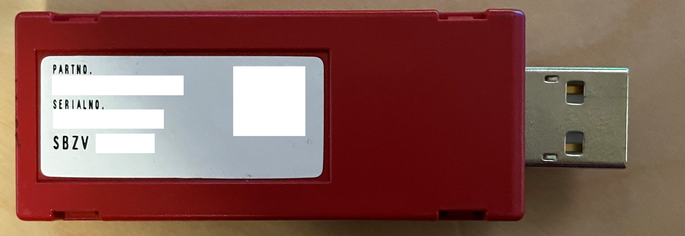
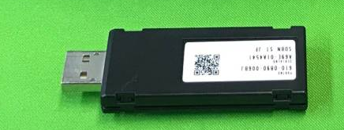

<!-- omit in toc -->
# nu-keychip

Archived: keychip information moved to the [main repo](https://github.com/diva-eng/sega-nu)

Information about the Sega Nu keychips
- [Introduction](#introduction)
- [Keychips](#keychips)
- [Tools used](#tools-used)
## Introduction
In the Sega Nu systems, system boot and application start is gated by the mysterious "keychip". A lot of systems sold online do not include the keychip since they are property of Sega and needed to be returned once the operator terminate contract with Sega. I was lucky enough to find two keychip being auctioned and I want to document my reverse engineering efforts. Hopefull later people are able to use this information to reconstruct keychip for the game they want to launch and keep these arcade machine running.

## Keychips
I obtained one keychip for PDAFT (Project Diva Arcade Future Tone) and an unknown one for the Nu SX platform.

Keychip for PDAFT

Keychip for Nu SX

Image credit to: [Yahoo Auction](https://yahoo.aleado.com/lot?auctionID=v570465702)

## Tools used

[USB2Sniffer](https://shop.lambdaconcept.com/home/35-usb2-sniffer.html)

[ScreamerM2](https://shop.lambdaconcept.com/home/43-screamer-m2.html)

[DSLogic Logic Analyzer](https://www.dreamsourcelab.com/product/dslogic-series/)